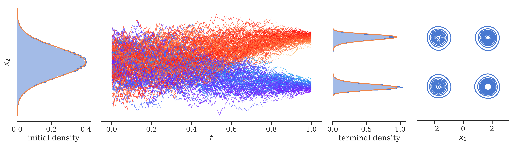

# Sampling via learned diffusions: `sde_sampler`
> Accompanying code for the paper ['Improved sampling via learned diffusions'](https://arxiv.org/abs/2307.01198) [[`ICLR'24`](https://openreview.net/forum?id=h4pNROsO06),[`BibTeX`](#references)] and ['An optimal control perspective on diffusion-based generative modeling'](https://arxiv.org/abs/2211.01364) [[`TMLR'24`](https://openreview.net/forum?id=oYIjw37pTP),[`BibTeX`](#references)].


> For improved performance, see ['Sequential Controlled Langevin Diffusions'](https://github.com/anonymous3141/SCLD) [[`ICLR'25`](https://openreview.net/forum?id=dImD2sgy86)] (combinations with SMC) and ['Underdamped Diffusion Bridges with Applications to Sampling'](https://github.com/DenisBless/UnderdampedDiffusionBridges) [[`ICLR'25`](https://openreview.net/forum?id=Q1QTxFm0Is)] (underdamped versions).


This repo contains various [methods](#solvers) (DIS, Bridge, DDS, PIS) to sample from unnormalized densities by learning to control stochastic differential equations (SDEs). Given an unnormalized target density $\rho=Zp_{\mathrm{target}}$, where $Z = \int \rho(x) \mathrm{d}x$, we optimize a neural network $u$ to control the SDE $$\mathrm{d}X^u_t = (\mu + \sigma u)(X^u_t,t) \mathrm{d}t + \sigma(t) \mathrm{d}W_t, \quad X^u_0 \sim p_{\mathrm{prior}},$$ 
such that $X^u_T \sim p_{\mathrm{target}}$. Then one can sample from the prior $p_{\mathrm{prior}}$ and simulate the SDE $X^u$ to obtain samples from $p_{\mathrm{target}}$.

<p align="center"></p>


## Installation

- **Repo:** First clone the repo:

  ```
  git clone git@github.com:juliusberner/sde_sampler.git
  cd sde_sampler
  ```

- **Environment:** We recommend using [Conda](https://conda.io/docs/user-guide/install/download.html) to set up the codebase:
  ```
  conda create -n sde_sampler python==3.9 pip --yes
  conda activate sde_sampler
  ```
- **GPU:** If you have a GPU, check your CUDA version using `nvidia-smi` and install compatible `cuda` (for `pykeops`) and `torch`/`torchvision` packages using the [PyTorch install guide](https://pytorch.org/get-started) (see [here](https://pytorch.org/get-started/previous-versions/) for previous versions).
  For instance, if your CUDA version is `>=11.7`, you could run:
  ```
  conda install pytorch==2.0.1 torchvision==0.15.2 pytorch-cuda=11.7 cuda-minimal-build=11.7 -c pytorch -c nvidia --yes
  ```
- **CPU:** In case you do not have a GPU, you can replace the previous step with:
  ```
  conda install pytorch torchvision cpuonly -c pytorch --yes
  ```

- **Packages:** Now, you can install the [`sde_sampler`](setup.py) package:
  ```
  pip install -e .
  ```

- **Wandb:** Finally, login to your wandb account:
  ```
  wandb login
  ```
  You can also omit this step and add the `wandb.mode=disabled` command line arg to your runs.

- **Additional requirements:** See [targets](#targets), for requirements and steps which are only needed for specific targets.

- **Test:** To test the `pykeops` and `torch` installations on a machine with GPU:
  ```
  python -c "import torch; print(torch.cuda.is_available())"
  python -c "import pykeops; pykeops.test_torch_bindings()"
  ```

## Quick Start

Sample from a [shifted double well](conf/target/dw_shift.yaml) using the [DIS solver](conf/solver/basic_dis.yaml) and the log-variance divergence:

```
python scripts/main.py target=dw_shift solver=basic_dis loss.method=lv
```

- This outputs a link to the metrics and plots: `wandb: 🚀 View run at <link>`
- You also find the metrics/plots/checkpoints locally at `logs/<Y-m-d>/<H-M-S>`.

## How-To

### Setup

We use:
* [`hydra`](https://hydra.cc/) for [config management](#configs) and [experiment execution](#multi-run--slurm).
* [`wandb`](https://wandb.ai/) for experiment tracking and hyperparameter [sweeps](#wandb-sweeps).


### Configs
All configs can be found in the folder [`conf`](conf). You can just adapt the existing `.yaml` configs or add new ones. Configs are hierarchical and will be dynamically created by composition, see the [Hydra intro](https://hydra.cc/docs/intro/) or run 
```
python scripts/main.py --help
```

Most important:

1. Configs are based on [`conf/base.yaml`](conf/base.yaml) and the solver-specific config in [`conf/solver`](conf/solver).

2. Config defaults can be overridden on the command line analogously as specified in the `defaults` list in each config. For instance:
    * [`conf/base.yaml`](conf/base.yaml) contains the default `solver: dis`. To select the PIS solver in [`conf/solver/basic_pis.yaml`](conf/solver/basic_pis.yaml), we can add the command line arg `solver=basic_pis`.
    * [`conf/solver/basic_pis.yaml`](conf/solver/basic_pis.yaml) contains the default `/model@generative_ctrl: score`. To use the model in [`conf/model/clipped.yaml`](conf/model/clipped.yaml), we can add the command line arg `model@generative_ctrl=clipped`.
    * To add a new default use `+`. To add the learning rate scheduler [`conf/lr_scheduler/multi_step.yaml`](conf/lr_scheduler/multi_step.yaml), use the command line arg `+lr_scheduler=multi_step`.

3. Each individual entry of the config can be overriden on the command line using the nested config keys separated by dots, e.g., `generative_ctrl.base_model.channels=32`. 

4. You can also change the `wandb` setting in [`conf/base.yaml`](conf/base.yaml). To change the project to `test`, add `wandb.project=test` to the args.


Combining the examples above:
```
python scripts/main.py solver=basic_pis model@generative_ctrl=clipped generative_ctrl.base_model.channels=32 +lr_scheduler=multi_step wandb.project=test
```


### Multi-run & Slurm

Run the experiment above on the [shifted double well](conf/target/dw_shift.yaml) as well as a [Gaussian mixture model](conf/target/gmm.yaml) for both the log-variance and the KL divergence (using the hydra multi-run flag `-m/--multirun`):

```
python scripts/main.py -m +launcher=<launcher> target=dw_shift,gmm solver=basic_dis loss.method=kl,lv
```
Set `<launcher>` to
- [`joblib`](conf/launcher/joblib.yaml) if you work on a local machine. This uses the [`joblib`](https://joblib.readthedocs.io/en/stable/) library.
- [`slurm`](conf/launcher/slurm.yaml) if you work on a [Slurm](https://slurm.schedmd.com/documentation.html) cluster. You might need to adapt the default configs in [`conf/launcher/slurm.yaml`](conf/launcher/slurm.yaml) to your cluster.

### Wandb sweeps

You can find an examplary sweep in [`conf/sweeps`](conf/sweeps).
1. Invoke the sweep:
  ```
  wandb sweep conf/sweeps/<sweep_name>.yaml
  ```

2. Start agents as described in the output of the previous command. For slurm, you can use 
  ```
  SWEEP_ID=<wandb_entity>/<wandb_project>/<sweep_id> sbatch -a 0-<num agents> bin/slurm_sweep.sh
  ```

### Resuming

You can resume a run by specifying its wandb id `wandb.id=<wandb-id>`. With the default settings, you can run
```
python scripts/main.py --config-name=setup wandb.id=<wandb-id>
```
and the previous configuration and latest ckeckpoint will be automatically downloaded from wandb.
When using the same log directory, the wandb id is inferred automatically (which is useful for slurm preemption). You can also add the log directory manually via the command line arg `hydra.run.dir=<logs/Y-m-d/H-M-S>`.
For more flexibility (e.g, adapting configs and command line args), you can also specify the checkpoint `ckpt_file=<path-to-ckpt-file>` directly.

## Experiments

### Solvers

Our predefined solvers in [`conf/solver`](conf/solver) include the following methods:

1. **Time-Reversed Diffusion Sampler (DIS)** `solver=dis` (see our [paper](https://arxiv.org/abs/2211.01364))

2. **Denoising Diffusion Sampler (DDS)** `solver=dds` (see the [DDS repo](https://github.com/franciscovargas/denoising_diffusion_samplers); note that we also provide `solver=dds_euler`, which uses the Euler integrator for DDS instead). 

3. **Path Integral Sampler (PIS)** `solver=pis` (see the [PIS repo](https://github.com/qsh-zh/pis))

4. **Bridge sampler (Bridge)** `solver=bridge` (see our [paper](https://arxiv.org/abs/2307.01198); this can be viewed as generalized Schrödinger bridge)

5. **Unadjusted Langevin algorithm (ULA)** `solver=langevin` 

The configs with prefix `basic_` in [`conf/solver`](conf/solver) are simplified and can easily be adapted to specific [targets](#targets) or settings. 

For all solvers except `langevin`, you can use either the KL divergence `loss.method=kl` or the log-variance divergence `loss.method=lv` (see our [paper](https://arxiv.org/abs/2307.01198)).
For the first three solvers, the log-variance divergence can also be computed over trajectories with the same initial point by using `loss.method=lv_traj`.
In most of our experiments, the log-variance divergence led to improved performance.


### Targets

Our predefined targets in [`conf/target`](conf/target) include the following distributions:

- **Funnel** `target=funnel` (10d, see our [paper](https://arxiv.org/abs/2211.01364) and the [PIS repo](https://github.com/qsh-zh/pis))

- **Gaussian Mixture Model** `target=gmm` (2d, see our [paper](https://arxiv.org/abs/2211.01364) and the [PIS repo](https://github.com/qsh-zh/pis))

- **Multi/Double-Well** `target=dw_shift`, `target=mw`, and `target=mw_50d` (1d/5d/50d, see our [paper](https://arxiv.org/abs/2211.01364))

- **Gaussian** `target=gauss_shift` (1d)

- **Image**: `target=img` (2d, see the [SNF repo](https://github.com/noegroup/stochastic_normalizing_flows)): For better visualization of the image density, we suggest to use `eval_batch_size=500000`.

- **Rings** `target=rings` (2d, see the [PIS repo](https://github.com/qsh-zh/pis))

- **Rosenbrock**: `target=rosenbrock` (15d, to test samplers for global optimization, see [arxiv:2111.00402](https://arxiv.org/abs/2111.00402) and [wikipedia](https://en.wikipedia.org/wiki/Rosenbrock_function))

- **Alanine Dipeptide** `target=aladip` (60d, see the [FAB repo](https://github.com/lollcat/fab-torch)): Install the following additional requirements
  ```
  conda install -c conda-forge openmm openmmtools=0.23.1 --yes
  pip install boltzgen@git+https://github.com/VincentStimper/boltzmann-generators.git@v1.0
  ```
  Then, download the evaluation data using
  ```
  bash bin/download_aladip.sh
  ```

- **NICE** `target=nice` (196d, see [arxiv:2208.07698](https://arxiv.org/abs/2208.07698) and https://github.com/fmu2/NICE): First, train the NICE model on MNIST using
  ```
  python scripts/train_nice.py
  ```
  or, on a slurm cluster, using
  ```
  sbatch bin/slurm_train_nice.sh
  ```
  This saves a checkpoint in `data/nice.pt`, which is then automatically used.

- **Log Gaussian Cox Process** `target=cox` (1600d, see the [PIS repo](https://github.com/qsh-zh/pis))


## References

If you use parts of this codebase in your research, please use the following BibTeX entries.

```
@article{berner2024optimal,
  title={An optimal control perspective on diffusion-based generative modeling},
  author={Berner, Julius and Richter, Lorenz and Ullrich, Karen},
  journal={Transactions on Machine Learning Research},
  issn={2835-8856},
  year={2024},
  url={https://openreview.net/forum?id=oYIjw37pTP},
}

@inproceedings{richter2024improved,
  title={Improved sampling via learned diffusions},
  author={Richter, Lorenz and Berner, Julius},
  booktitle={International Conference on Learning Representations},
  year={2024}
}
```


## License

The majority of the project is licensed under MIT. 
Portions of the project are adapted from other repositories (as mentioned in the code): 
- https://github.com/fmu2/NICE is also licensed under MIT,
- https://github.com/yang-song/score_sde is licensed under Apache-2.0, 
- https://github.com/noegroup/stochastic_normalizing_flows is licensed under BSD-3-Clause,
- the repositories https://github.com/lollcat/fab-torch, https://github.com/qsh-zh/pis, and https://github.com/fwilliams/scalable-pytorch-sinkhorn do not provide licenses.
